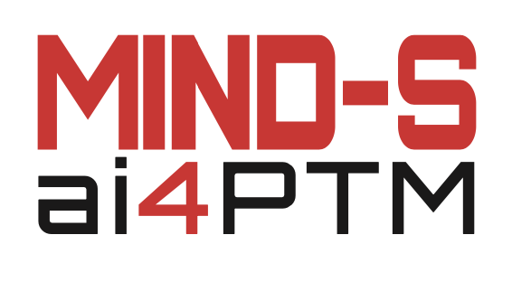

{width=100}

# MIND-S AI4PTM

MIND (Multilabel INterpretable Deep learning method for PTM prediction) is a deep learning tool for making PTM predictions based on protein sequence, or protein structure. MIND-S features interpretability through evaluating the saliency for each input residual. MIND can also be utilized as a tool for evaluating effects of genetic mutation (e.g. SNP) on PTM.

## Set up
```bash
git clone ....
cd MIND
pip install -r requirement
```

## 
